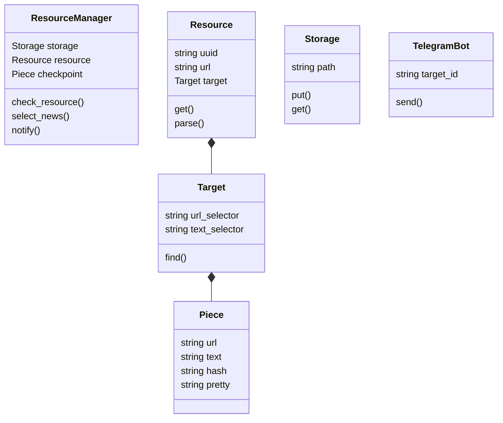

# Telegram Feed

Daemon to watch for multiple web resources, parse for some data and send notifies to Telegram on updates.

Useful to watch for low-frequent updates:

- Blog posts, when there's no RSS/Atom
- Open positions at custom careers page
- Academic articles :)

**Not recommended** for other cases since it uses really dumb and straightforward approach.

## Usage

- Edit `config.example.yml` with:
  - Proper token
  - Channel/group ID
  - Resources specs

  Save resulting file it as `config.yml`

- Run container with your config and persistent data folder:
  ```
  docker run \
    --rm -d --name tg-feed \
    -v ./config.yml:/app/config.yml \
    agrrh/tg-feed
  ```

## Class Diagram



## Credits

- Inspired by [Altan Barahov](https://github.com/nett00n/AltanBarahovProject) project
